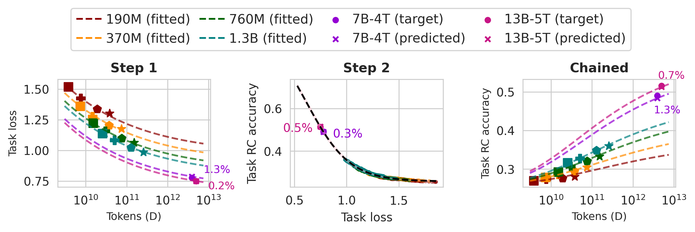

# OLMo-ladder

The OLMo-ladder is a set of scripts and model configurations for fitting scaling laws on smaller models, to take modeling or data-mixing decisions for pretraining. 

For details on reproducing results from the [paper](https://arxiv.org/pdf/2412.04403), please see [src/scripts/paper](src/scripts/paper/README.md).

## Table of Contents

- [Installation](#installation)
- [Running the ladder](#running-the-ladder)
- [Adding new evals](#adding-new-evals)
- [Task Scaling Laws](#task-scaling-laws)
- [Trained ladder models](#trained-models)
- [Usage](#examples-of-usage-of-ladder-based-scaling-laws)
- [Citation](#citation)


## Installation

```bash
conda create -n ladder python=3.10
conda activate ladder
cd OLMo-ladder
pip install -e ".[all]"  # options include plotting, beaker, wandb, dev, ladder
```

## Running the ladder

See [src/ladder](src/ladder/README.md) for instructions on running the ladder models. 
Instructions for adding new evaluation sets can also be found there.

## Task scaling laws

We employ a two-step approach, first predicting an intermediate loss feature, and then, using it to predict the final task accuracy. 




## Trained models

* 190M models: [190M-1xC](), [190M-2xC](), [190M-5xC](), [190M-10xC]()
* 370M models: [370M-1xC](), [370M-2xC](), [370M-5xC](), [370M-10xC]()
* 760M models: [760M-1xC](), [760M-2xC](), [760M-5xC](), [760M-10xC]()
* 1B  models: [1B-1xC](), [1B-2xC](), [1B-5xC](), [1B-10xC]()

## Examples of usage of ladder-based scaling laws

Scaling laws on ladder models can be used for pretraining development; for modeling decisions as well as data decisions. 

* [DataDecide](https://github.com/allenai/DataDecide)

## Citation

```
@article{Bhagia2024EstablishingTS,
  title={Establishing Task Scaling Laws via Compute-Efficient Model Ladders},
  author={Akshita Bhagia and Jiacheng Liu and Alexander Wettig and David Heineman and Oyvind Tafjord and A. Jha and Luca Soldaini and Noah A. Smith and Dirk Groeneveld and Pang Wei Koh and Jesse Dodge and Hanna Hajishirzi},
  journal={ArXiv},
  year={2024},
  volume={abs/2412.04403},
  url={https://api.semanticscholar.org/CorpusID:274514987}
}
```
