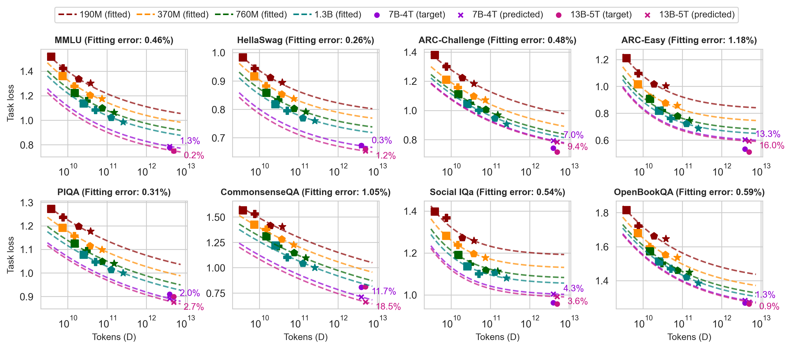
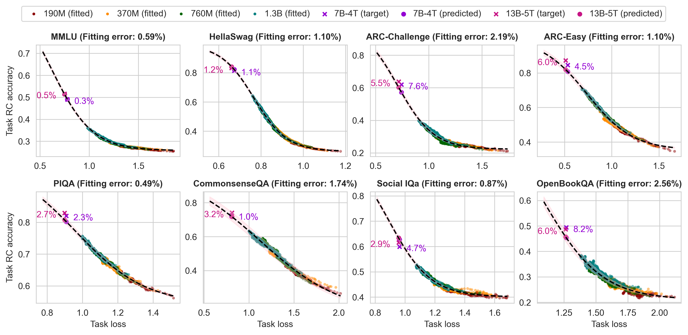
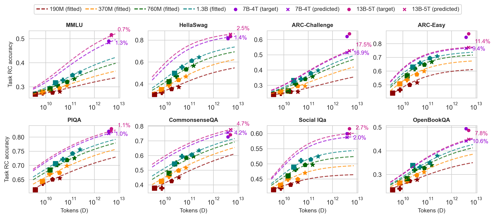
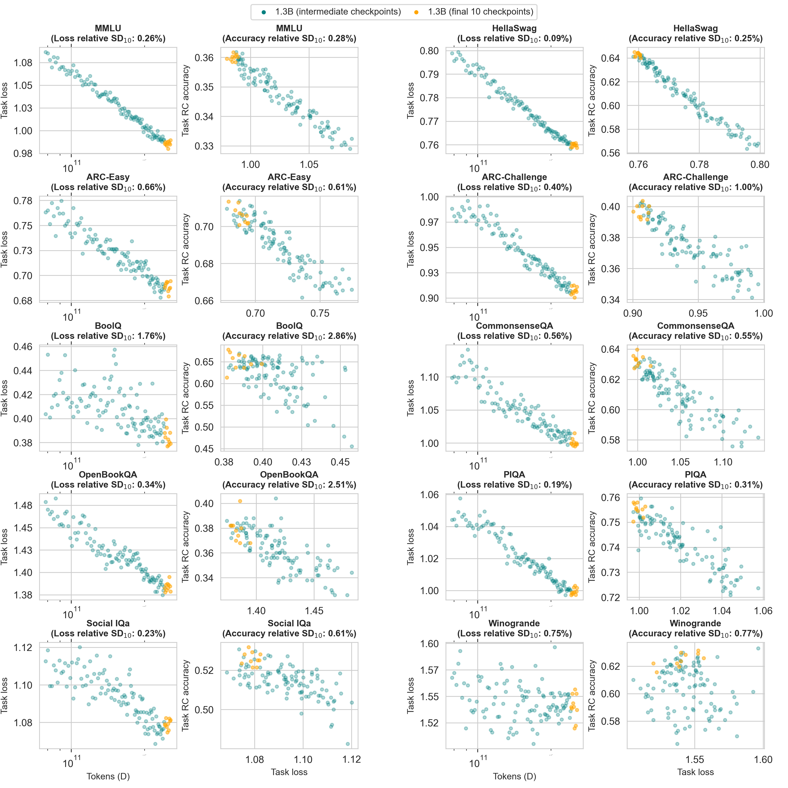
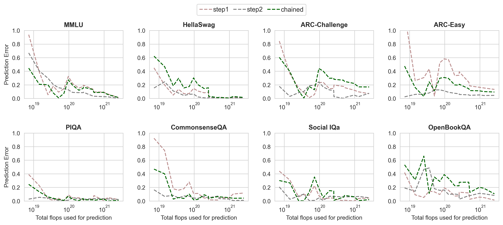
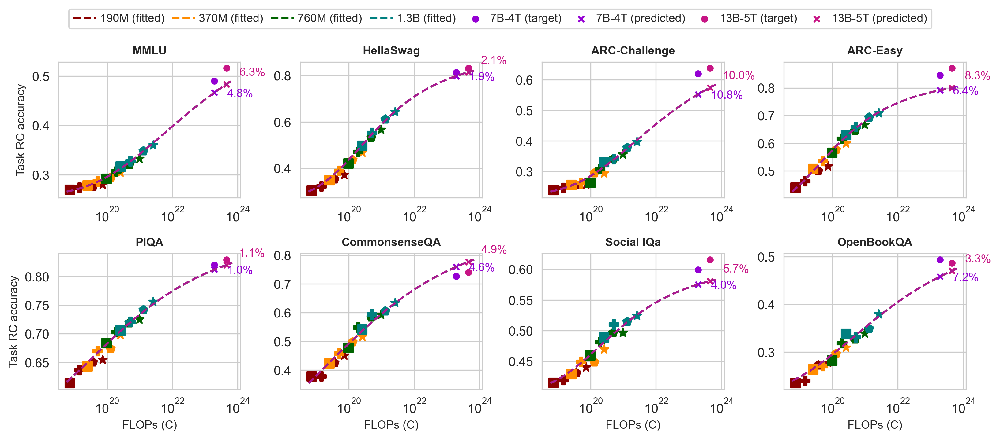

# Establishing Task Scaling Laws via Compute-Efficient Model Ladders

[Paper](https://arxiv.org/pdf/2412.04403)

This guide shows how to fit scaling laws using the ladder training runs. For information on how to run ladder models, see [TODO](link).

## Setup

### Installation

```bash
conda create -n ladder python=3.10
conda activate ladder
cd OLMo-ladder
pip install -e ".[plotting]"
```

The evaluation results for the ladder runs in the paper can be found at [src/scripts/paper/data](data). All the commands should be run from the base folder [OLMo-ladder](../../..).

## Glossary

TODO

| Term | Definition |
| ---- | ---------- |
| Intermediate feature | The target metric used for step 1|
| BPB loss | Task-specific bits-per-byte loss (See paper for description)| 
| C4 loss | Validation loss on C4 set from PALOMa|
| Chained prediction | Combined two-step prediction |
| N | Number of model parameters |
| D | Number of training tokens | 
| C | Number of compute-FLOPs |
| Moving average | The metrics are smoothened over a window |
| Skip perc | First few evaluated steps are skipped |


## Step 1

Step 1 fits a power law from (N, D) to the target metric. We use the task bpb loss as the target metric for step 1.

```bash

# target metric: task bpb loss
python src/scripts/step1.py \
    -k v2_main \
    -c src/scripts/paper/configs/final.json \
    -o src/scripts/paper/figures/step1_main.png \
    --moving_avg 5
```




```bash
# target metric: c4 loss
python src/scripts/step1.py \
    -k v2_main \
    -c src/scripts/paper/configs/final.json \
    -o src/scripts/paper/figures/step1_c4_main.pdf \
    -y c4 \
    --moving_avg 5

# target metric: task accuracy

python src/scripts/step1.py \
    -k v2_main \
    -c src/scripts/paper/configs/final.json \
    -o src/scripts/paper/figures/step1_acc_main.pdf \
    -y rc_acc \
    --moving_avg 5


# target metric: task ce loss
python src/scripts/step1.py \
    -k v2_main \
    -c src/scripts/paper/configs/final.json \
    -o src/scripts/paper/figures/step1_taskce_main.pdf \
    -y rc_soft_log
```


## Step 2

Step 2 fits a sigmoid function from the intermediate feature to the target metric (accuracy). We use the task bpb loss as the intermediate feature. This script uses ground truth numbers for the intermediate feature.

```bash
# using task bpb loss as the intermediate feature
python src/scripts/step2.py \
    -k v2_main \
    -c src/scripts/paper/configs/final.json \
    -o src/scripts/paper/figures/step2_main.png \
    --skip_perc 0.1 \
    --moving_avg 5
```




```bash
# using c4 loss as the intermediate feature.
python src/scripts/step2.py \
    -k v2_main \
    -c src/scripts/paper/configs/final.json \
    -o src/scripts/paper/figures/step2_c4_main.pdf \
    -x c4 \
    --skip_perc 0.1 \
    --moving_avg 5

# using task ce loss as the intermediate feature.
python src/scripts/step2.py \
    -k v2_main \
    -c src/scripts/paper/configs/final.json \
    -o src/scripts/paper/figures/step2_taskce_main.pdf \
    -x rc_soft_log \
    --skip_perc 0.5 \
    --use_log_sigmoid
```


## Chained predictions

The predict script takes the predicted output of step 1 as input for step 2 to give a combined prediction.

```bash
python src/scripts/predict.py \
    -k v2_main \
    -c src/scripts/paper/configs/final.json \
    --step2-config-path src/scripts/paper/configs/final.json \
    -o src/scripts/paper/figures/chained_main.png \
    -n 13202396160 \
    -d 5000088518656 \
    -t 13B-5T \
    --skip_perc 0.1 \
    --moving_avg 5
```



## Variance analysis 

```bash
python src/scripts/variance_analysis.py \
    -k v2_main_variance \
    -c src/scripts/paper/configs/final_variance.json \
    -o src/scripts/paper/figures/variance.png \
    --last_n_points 10 \
    --run_prediction \
    --print_table_as_latex
```




## Analyses & Alternative Design Choices


### Compute vs Prediction Error

```bash
python src/scripts/compute_vs_error_analysis.py \
    --moving_avg 5 \
    --skip_perc 0.1 \
    -o src/scripts/paper/figures/stacked_N_error_all.png \
    --vary N \
    --which_step all

python src/scripts/compute_vs_error_analysis.py \
    --moving_avg 5 \
    --skip_perc 0.1 \
    -o src/scripts/paper/figures/stacked_xC_error_all.png \
    --vary xC \
    --which_step all

python src/scripts/compute_vs_error_analysis.py \
    --moving_avg 5 \
    --skip_perc 0.1 \
    -o src/scripts/paper/figures/stacked_flops_error_all.pdf \
    --vary flops \
    --which_step all
```


### Using C (FLOPs) instead of (N, D)

```bash
python src/scripts/predict_flops.py \
    -k v2_main \
    -c src/scripts/paper/configs/final.json \
    --step2-config-path src/scripts/paper/configs/final.json \
    -o src/scripts/paper/figures/chained_flops_main.png \
    -n 6887575552 \
    -d 3945065873408 \
    -t 7B-4T \
    --skip_perc 0.1 \
    --moving_avg 5
```



7. Alternative intermediate features

8. Single step vs two-step

9. MC accuracy prediction -- ask Jiacheng re: figures


## Citation

```
@article{Bhagia2024EstablishingTS,
  title={Establishing Task Scaling Laws via Compute-Efficient Model Ladders},
  author={Akshita Bhagia and Jiacheng Liu and Alexander Wettig and David Heineman and Oyvind Tafjord and A. Jha and Luca Soldaini and Noah A. Smith and Dirk Groeneveld and Pang Wei Koh and Jesse Dodge and Hanna Hajishirzi},
  journal={ArXiv},
  year={2024},
  volume={abs/2412.04403},
  url={https://api.semanticscholar.org/CorpusID:274514987}
}
```